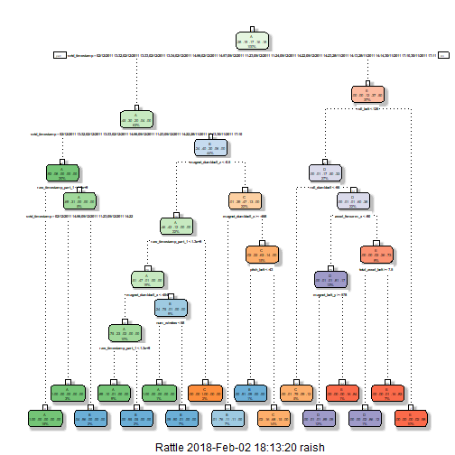

## 1. Introduction
Using devices such as Jawbone Up, Nike FuelBand, and Fitbit it is now possible to collect a large amount of data about personal activity relatively inexpensively. These type of devices are part of the quantified self movement - a group of enthusiasts who take measurements about themselves regularly to improve their health, to find patterns in their behavior, or because they are tech geeks. One thing that people regularly do is quantify how much of a particular activity they do, but they rarely quantify how well they do it. In this project, your goal will be to use data from accelerometers on the belt, forearm, arm, and dumbell of 6 participants. They were asked to perform barbell lifts correctly and incorrectly in 5 different ways. More information is available from the website here: <http://web.archive.org/web/20161224072740/http:/groupware.les.inf.puc-rio.br/har> (see the section on the Weight Lifting Exercise Dataset).

### Data
The training data for this project are available here: <https://d396qusza40orc.cloudfront.net/predmachlearn/pml-training.csv>

The test data are available here: <https://d396qusza40orc.cloudfront.net/predmachlearn/pml-testing.csv>

The data for this project come from this source: <http://web.archive.org/web/20161224072740/http:/groupware.les.inf.puc-rio.br/har>. If you use the document you create for this class for any purpose please cite them as they have been very generous in allowing their data to be used for this kind of assignment.

### What you should submit?
The goal of your project is to predict the manner in which they did the exercise. This is the `classe` variable in the training set. You may use any of the other variables to predict with. You should create a report describing how you built your model, how you used cross validation, what you think the expected out of sample error is, and why you made the choices you did. You will also use your prediction model to predict 20 different test cases.

* Your submission should consist of a link to a Github repo with your R markdown and compiled HTML file describing your analysis. Please constrain the text of the writeup to < 2000 words and the number of figures to be less than 5. It will make it easier for the graders if you submit a repo with a gh-pages branch so the HTML page can be viewed online (and you always want to make it easy on graders :-).

* You should also apply your machine learning algorithm to the 20 test cases available in the test data above. Please submit your predictions in appropriate format to the programming assignment for automated grading. See the programming assignment for additional details.

### Load packages, libraries and set seed

```r
setwd("C:/Users/raish/mlfinalproject") # Working Directory
library(caret); library(randomForest); library(rpart)
library(rpart.plot); library(RColorBrewer); library(rattle)
set.seed(1234)
```

## 2. Getting and Cleaning the Data


```r
# 'training' data file
trainFile <- "https://d396qusza40orc.cloudfront.net/predmachlearn/pml-training.csv" 
#'testing' data file
testFile <- "https://d396qusza40orc.cloudfront.net/predmachlearn/pml-testing.csv"
```

Load the data 

```r
training <- read.csv(url(trainFile), na.strings = c("NA", "#DIV/0!", ""))
testing <- read.csv(url(testFile), na.strings = c("NA", "#DIV/0!", ""))
```

Partitioning the data

```r
inTrain <- createDataPartition(y=training$classe, p=0.6, list=FALSE)
myTraining <- training[inTrain, ]
myTesting <- training[-inTrain, ]
dim(myTraining);dim(myTesting)
```

```
## [1] 11776   160
```

```
## [1] 7846  160
```

The following transformations are done to clean the data:
**Transformation 1:** Cleaning `NearZeroVariance` variables. (Run this code to view possible NearZeroVariance variables)


```r
myDataNZV <- nearZeroVar(myTraining, saveMetrics=TRUE)
```

We create a subset of NearZeroVariance variables,


```r
myNZV <- names(myTraining) %in% c("new_window", "kurtosis_roll_belt", "kurtosis_picth_belt",
"kurtosis_yaw_belt", "skewness_roll_belt", "skewness_roll_belt.1", "skewness_yaw_belt",
"max_yaw_belt", "min_yaw_belt", "amplitude_yaw_belt", "avg_roll_arm", "stddev_roll_arm",
"var_roll_arm", "avg_pitch_arm", "stddev_pitch_arm", "var_pitch_arm", "avg_yaw_arm",
"stddev_yaw_arm", "var_yaw_arm", "kurtosis_roll_arm", "kurtosis_picth_arm",
"kurtosis_yaw_arm", "skewness_roll_arm", "skewness_pitch_arm", "skewness_yaw_arm",
"max_roll_arm", "min_roll_arm", "min_pitch_arm", "amplitude_roll_arm", "amplitude_pitch_arm",
"kurtosis_roll_dumbbell", "kurtosis_picth_dumbbell", "kurtosis_yaw_dumbbell", "skewness_roll_dumbbell",
"skewness_pitch_dumbbell", "skewness_yaw_dumbbell", "max_yaw_dumbbell", "min_yaw_dumbbell",
"amplitude_yaw_dumbbell", "kurtosis_roll_forearm", "kurtosis_picth_forearm", "kurtosis_yaw_forearm",
"skewness_roll_forearm", "skewness_pitch_forearm", "skewness_yaw_forearm", "max_roll_forearm",
"max_yaw_forearm", "min_roll_forearm", "min_yaw_forearm", "amplitude_roll_forearm",
"amplitude_yaw_forearm", "avg_roll_forearm", "stddev_roll_forearm", "var_roll_forearm",
"avg_pitch_forearm", "stddev_pitch_forearm", "var_pitch_forearm", "avg_yaw_forearm",
"stddev_yaw_forearm", "var_yaw_forearm")
myTraining <- myTraining[!myNZV]
dim(myTraining)
```

```
## [1] 11776   100
```

**Transformation 2:** Removing first column of Dataset - Removing first variable so that it does not interfere with the machine learning algorithms:


```r
myTraining <- myTraining[c(-1)]
```

**Transformation 3:** Cleaning the variables which has too many NA's. For Variables that have more than a 60% threshold of NA's we will ignore them.


```r
trainingV3 <- myTraining #creating another subset to iterate in loop
for(i in 1:length(myTraining)) { #for every column in the training dataset
        if( sum(is.na( myTraining[, i] ) ) /nrow(myTraining) >= .6 ) { #if n?? NAs > 60% of total observations
        for(j in 1:length(trainingV3)) {
            if( length(grep(names(myTraining[i]), names(trainingV3)[j]) ) ==1)  { #if the columns are the same:
                trainingV3 <- trainingV3[ , -j] #Remove that column
            }   
        } 
    }
}
#To check the new N?? of observations
dim(trainingV3)
```

```
## [1] 11776    58
```


```r
#Setting back to our set:
myTraining <- trainingV3
rm(trainingV3)
```

Now we perform the same 3 transformations for `myTesting` and `testing` data sets.


```r
clean1 <- colnames(myTraining)
clean2 <- colnames(myTraining[, -58]) #already with classe column removed
myTesting <- myTesting[clean1]
testing <- testing[clean2]

#To check the new N?? of observations
dim(myTesting)
```

```
## [1] 7846   58
```

```r
#To check the new N?? of observations
dim(testing)
```

```
## [1] 20 57
```

To ensure proper functioning of Decision Trees and especially RandomForest Algorithm with the Test data set (data set provided), we need to coerce the data into the same type.


```r
for (i in 1:length(testing) ) {
        for(j in 1:length(myTraining)) {
        if( length( grep(names(myTraining[i]), names(testing)[j]) ) ==1)  {
            class(testing[j]) <- class(myTraining[i])
        }      
    }      
}
#And to make sure Coertion really worked, simple smart ass technique:
testing <- rbind(myTraining[2, -58] , testing) #note row 2 does not mean anything, this will be removed right.. now:
testing <- testing[-1,]
```

## 3. Using Machine Learning algorithm for prediction: Decision Tree


```r
modFitA1 <- rpart(classe ~ ., data=myTraining, method="class")
```

To view the decision tree with fancy :


```r
fancyRpartPlot(modFitA1)
```



### Prediction


```r
predictionsA1 <- predict(modFitA1, myTesting, type = "class")
```

Using confusion Matrix to test results:


```r
confusionMatrix(predictionsA1, myTesting$classe)
```

```
## Confusion Matrix and Statistics
## 
##           Reference
## Prediction    A    B    C    D    E
##          A 2161   61    5    3    0
##          B   50 1271   95   64    0
##          C   21  177 1242  203   65
##          D    0    9   19  899   92
##          E    0    0    7  117 1285
## 
## Overall Statistics
##                                           
##                Accuracy : 0.8741          
##                  95% CI : (0.8665, 0.8813)
##     No Information Rate : 0.2845          
##     P-Value [Acc > NIR] : < 2.2e-16       
##                                           
##                   Kappa : 0.8407          
##  Mcnemar's Test P-Value : NA              
## 
## Statistics by Class:
## 
##                      Class: A Class: B Class: C Class: D Class: E
## Sensitivity            0.9682   0.8373   0.9079   0.6991   0.8911
## Specificity            0.9877   0.9670   0.9281   0.9817   0.9806
## Pos Pred Value         0.9691   0.8588   0.7272   0.8822   0.9120
## Neg Pred Value         0.9874   0.9612   0.9795   0.9433   0.9756
## Prevalence             0.2845   0.1935   0.1744   0.1639   0.1838
## Detection Rate         0.2754   0.1620   0.1583   0.1146   0.1638
## Detection Prevalence   0.2842   0.1886   0.2177   0.1299   0.1796
## Balanced Accuracy      0.9779   0.9021   0.9180   0.8404   0.9359
```

## 4. Using ML algorithms for prediction: Random Forests


```r
modFitB1 <- randomForest(classe ~. , data=myTraining)
```

Predicting in-sample error:

```r
predictionsB1 <- predict(modFitB1, myTesting, type = "class")
```

Using confusion Matrix to test results:


```r
confusionMatrix(predictionsB1, myTesting$classe)
```

```
## Confusion Matrix and Statistics
## 
##           Reference
## Prediction    A    B    C    D    E
##          A 2232    2    0    0    0
##          B    0 1516    4    0    0
##          C    0    0 1362    5    0
##          D    0    0    2 1280    0
##          E    0    0    0    1 1442
## 
## Overall Statistics
##                                         
##                Accuracy : 0.9982        
##                  95% CI : (0.997, 0.999)
##     No Information Rate : 0.2845        
##     P-Value [Acc > NIR] : < 2.2e-16     
##                                         
##                   Kappa : 0.9977        
##  Mcnemar's Test P-Value : NA            
## 
## Statistics by Class:
## 
##                      Class: A Class: B Class: C Class: D Class: E
## Sensitivity            1.0000   0.9987   0.9956   0.9953   1.0000
## Specificity            0.9996   0.9994   0.9992   0.9997   0.9998
## Pos Pred Value         0.9991   0.9974   0.9963   0.9984   0.9993
## Neg Pred Value         1.0000   0.9997   0.9991   0.9991   1.0000
## Prevalence             0.2845   0.1935   0.1744   0.1639   0.1838
## Detection Rate         0.2845   0.1932   0.1736   0.1631   0.1838
## Detection Prevalence   0.2847   0.1937   0.1742   0.1634   0.1839
## Balanced Accuracy      0.9998   0.9990   0.9974   0.9975   0.9999
```

Thus we can see that Random Forests yielded better Results.

## 5. Conclusion
In this study, 19622 observations from weight lifting exercise were used to analyze and predict correct body movement from others during the exercise. 60% of the total observations were used to build a model by random forest method, and the rest of 40% of the observations were used for model validation. 

The model statistics showed that the built model had the overall accuracy of 97% for the testing set, which is not overlapping with observations used to built the model. The sensitivity was in between 92%-99% and the specificity was over 99% for all classes (class A-E, total 5 classes. class A is the data from correct exercise while the other classes were data from exercises done in a wrong way). Overall, the model is well developed to predict the exercise classes during weight lifting. 

As for the limitation in this study, the observation data used in the analysis was collected from 6 young healthy participants in an experiment using Microsoft Kinect. Therefore, under those condition, the model is expected to perform over 95% accuracy; however, with different conditions, such as experiments with elderly people and/or using different device, the model might not perform well as shown in the analysis.

## 6. Generating Files to submit as answers for the Assignment

Finally, using the provided Test Set out-of-sample error.

For Random Forests we use the following formula, which yielded a much better prediction in in-sample:


```r
predictionsB2 <- predict(modFitB1, testing, type = "class")
```

Function to generate files with predictions to submit for assignment


```r
pml_write_files = function(x){
  n = length(x)
  for(i in 1:n){
    filename = paste0("problem_id_",i,".txt")
    write.table(x[i],file=filename,quote=FALSE,row.names=FALSE,col.names=FALSE)
  }
}

pml_write_files(predictionsB2)
```
